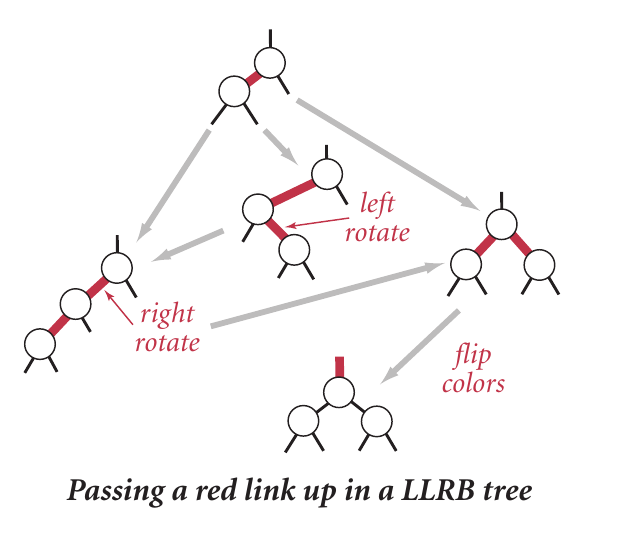

# 红黑树

## 步骤

- 创建基本node节点（即普通二叉树数据结构），包括颜色，左右子树
- 创建红黑树数据结构，包括红黑树基本操作
    - 左旋
    - 右旋
    - 变色
    - 注意两种变色情况
        - 插入节点后，其父节点两个子节点都是红色
        - 插入节点后，自身和父节点都是红色

## 数据结构

- node
    - 成员
        - lchild
        - rchild
        - color
        - key
        - value
    - 操作
        - rotateLeft(Node* node) -> node*
        - rotateRight(Node* node) -> node*
        - flipColors(Node* node)
- red black tree
    - 成员
        - root
    - 操作
        - 添加新的节点
        - 删除节点

# 红黑树牛逼!!!
